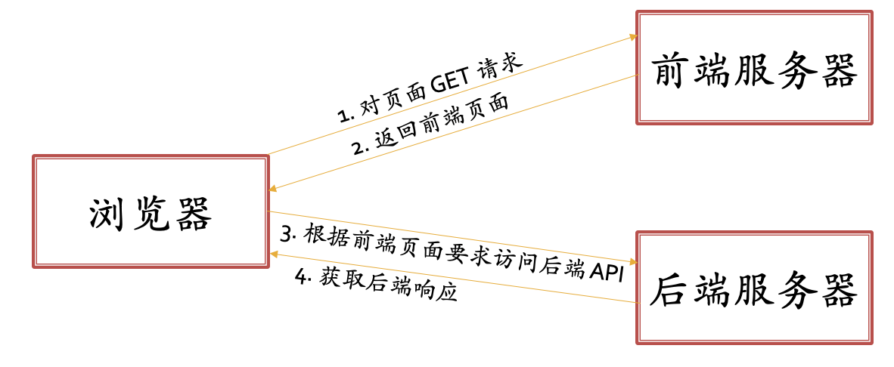
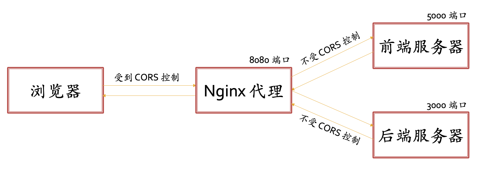

# 前后端分离的安全问题

## 跨域限制

现在最常见的前后端分离架构如下图所示：

这个架构实际上有一个极大的危险，因为前端服务器事实上可以返回任何嵌入在 HTML 中的代码，其完全可以是恶意的，这可能导致很严重的后果（比如帮你在 info 上申请退学）。这类问题统称为**跨域安全问题**。

为了解决这一问题，现代网络协议限制一个站点发来的前端只能访问同域名同端口的后端，这些限制统称为**跨域限制**。比如跨域资源共享机制（**C**ross **O**rigin **R**esource **S**haring）就是其中一例，其包括了浏览器对发出跨域的限制和服务器端对接受跨域的限制，具体表现为：

- 支持 CORS 的浏览器会拦截所有未成功通过预检的请求并报错
- 支持 CORS 的服务器可以选择自己信任哪些源发送的请求

这里提到了**预检（Preflight）**这一概念。预检是一个使用 OPTIONS 方法的 HTTP 请求，浏览器在发送真实的跨域请求前，首先会向目标发送预检请求，如果目标是支持 CORS 的服务器，预检请求的应答头中会包括该目标服务器所信任的源的列表。若浏览器发现这一跨域请求的源不在目标的信任列表中，就会拦截这一请求。

!!! note "Tips"

    CORS 的主体是浏览器，是浏览器自行发送预检请求，也是浏览器自行拦截不合法跨域请求。

但 CORS 机制需要浏览器和服务器都支持，虽说现行大部分浏览器都支持了 CORS 机制，但部分服务器并未实行 CORS 机制。为了安全<del>（直接访问不支持 CORS 的后端都被现代浏览器 ban 了）</del>，我们建议在开发后端的时候尽量支持 CORS 机制，只需要在 HTTP 应答头中包含信任源列表即可。

当然，你的后端也可以不支持 CORS 机制，可以使用一些其他方式来绕过跨域限制实现事实上的跨域请求<del>（直接把浏览器的跨域限制关了）</del>。下面来简单讲解两种，即 JSONP 方法与反向代理方法。

## JSONP 方法

JSONP 方法的核心是请求静态资源不受跨域限制。

比如，HTML 之中用于嵌入 JavaScript 的标签 `<script />` 中有一个 `src` 属性，如果在其中填入 URL 则可以用来加载远程服务器中的 JavaScript 脚本。如果设置了这一属性，浏览器会**无视跨域限制**向该 URL 发出方法为 GET 的 HTTP 请求。这个时候，你所开发的后端就可以接收到事实上的跨域请求并处理了。

但是 JSONP 方法只能应用在 GET 方法上，并且较为有局限性。

## 代理

实现跨域请求还有一个重要方案是配置反向代理使得前后端服务器暴露同一端口。

本部分不仅仅会讲解用于跨域的反向代理技术，也会同时介绍一般意义上的正向代理技术。

代理出现的一个原因是有时我们可能无法访问到某些服务器<del>（比如部分国外的网站）</del>，然而如果存在一个中间服务器我们可以访问，而中间服务器可以访问目标服务器，那么我们就可以将这个中间服务器作为我们的**正向代理**帮我们代理访问目标服务器的任务。

正向代理的一个特征是目标服务器并不能真正了解访问它的客户端，这是因为代理服务器屏蔽了真实的客户端，这提高了安全性。此外，通过正向代理可以实现访问加速，因为代理服务器获取了目标资源后就可以缓存在自身硬盘上，其他客户端想要经过它访问目标的时候就可以直接从自身存储中返回数据。

与正向代理是代理客户端相反，反向代理是代理服务器。我们可以用反向代理服务器代理若干个服务器，这样客户端请求服务器的时候，事实上是由反向代理服务器应答。这样做可以做到屏蔽真实的服务器，以及负载均衡（因为反向代理服务器可以决定用于平衡、缓冲客户端的请求）。

### 利用反向代理跨域

!!! note "反向代理可行的原因"

    还记得为什么一般的跨域不可行么？是因为浏览器会主动发送预检并拦截不通过预检的请求。然而不涉及浏览器的时候，比如说两个不在同一域之下的服务器之间通信，是不会受到跨域限制的。这也就是先前强调 **CORS 的主体是浏览器**的原因。

    反向代理成功的核心原因就是**让浏览器认为我们并没有跨域**。

假设现在本地 5000 端口运行前端服务器而 3000 端口运行后端服务器，此时若使用浏览器访问 5000 端口的网页并在网页中请求 3000 端口的数据，就会发生跨域，从而请求被浏览器拦截。

那么，我们在本地 8080 端口运行一个 Nginx 代理服务器来代理前端和后端的服务器（即反向代理）。首先，在代理服务器设置中约定一个能够区分请求应当转发给前端还是后端服务器的格式（比如以 `/api` 开头的路径转发给后端服务器，其余全部转发到前端服务器）。然后我们就可以注意到，我们无论是请求前端服务器的 HTML 模板还是请求后端服务器的数据，对浏览器而言，都是在访问 8080 端口。这样，前后端暴露端口就是统一的，从而能够实现事实上的跨域：

