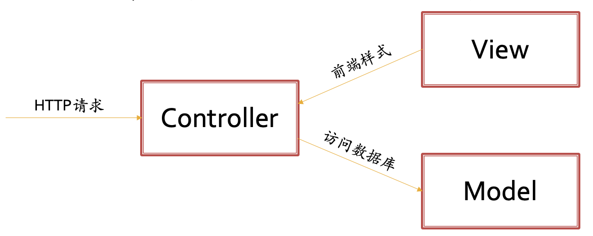

# Web 框架

Web 框架顾名思义，是用于创建 Web 应用的一种框架，其可以使我们很方便地编写出一个 Web 应用。常见的 Web 框架一般采取 MVC 架构：

这里 Controller 会接受其所收到的 HTTP 请求，并通过 Model 访问数据库等持久化存储，最后通过 View 渲染 HTML 页面并返回。基于 MVC 架构很容易构建一个传统的 SSR Web 应用。

一个好的 Web 框架往往具有下述功能：

- （Controller）实现 HTTP 等网络协议（部分还会实现 WebSocket）
- （Controller）实现 URL 解析
- （Model）实现对数据库的操作
- 对高并发等应用场景作出相应优化
- 对开发、配置、部署、维护等操作进行集成和优化

常见的 Web 框架包括：

- (Python) Django, Flask
- (JavaScript) Express.js
- (PHP) Laravel, CakePHP
- (Ruby) Ruby on rails
- (Java) Spring
- (C#) ASP.NET
- (Go) Fiber

!!! warning "易混淆的概念"

    Django 采用了带有路由的 MVC 架构，但是其对各个部分的命名与惯例有所差异，在 Django 小作业文档中对此有说明。

## CSR 与 Web 前端框架

先前提到随着 CSR 模式的出现，前端的代码开发也变得不可忽视。比如在传统的 Django 开发中，开发者可能需要手写 HTML 模板，然后再在 Controller 之中向其中填入数据。然而现今美观、结构复杂、交互性强的网页已经很难依靠手写 HTML、CSS、JS 实现，比如仅仅想要渲染一个新闻列表可能就会有成百上千行的代码量。再加上各大主流浏览器对 HTML、CSS 等的实现有一定差异，前端急需完成统一。基于这些需求，所以 Web 前端框架应运而生。

Web 前端框架的前身是各种 JavaScript 函数库，在真正意义上的前端框架出现之前，这些函数库用于简化编写 HTML、CSS、JS 的过程。随着这些代码经验逐步累积，最终催生了目前主流的三大 Web 前端框架，即 Vue、React 与 Angular。

随着 Web 前端框架的出现，传统意义上的 Web 框架，如 Django、Spring 等，也逐步改称为 Web 后端框架，并且其 View 部分也不再返回渲染完好的 HTML，而仅仅是返回数据供 Web 前端框架渲染得到最终 HTML。
