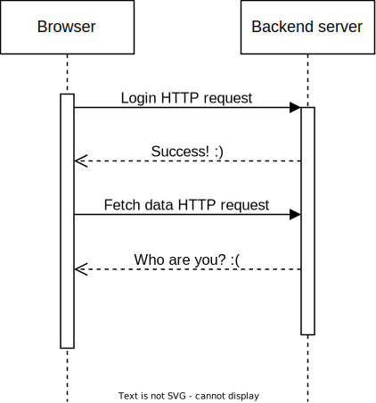
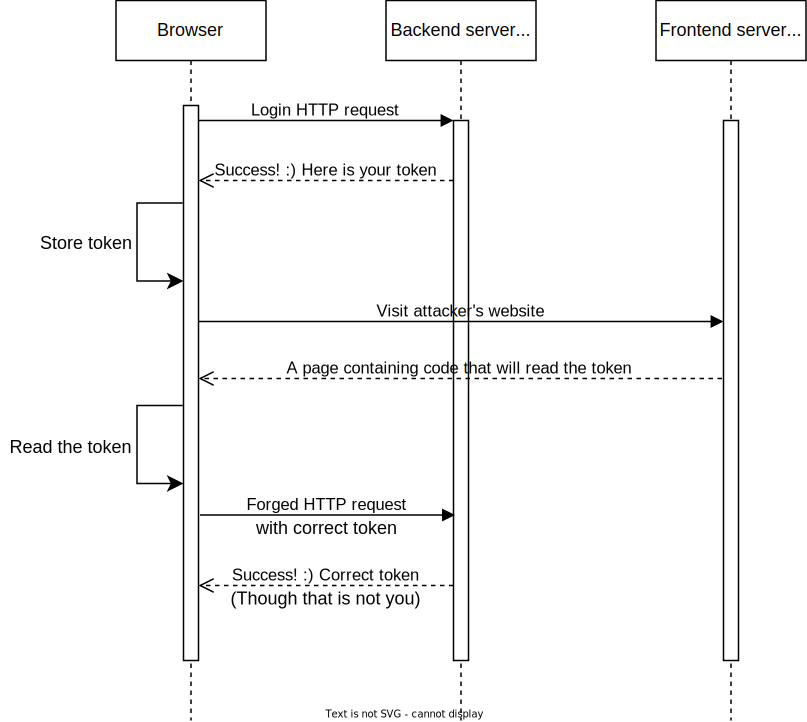
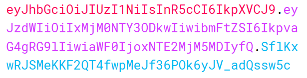

# 前后端交互鉴权问题

最初的 Web 应用是用户无关的，即无论是谁，只要在相同时间访问了相同的 Web 应用，其向后端服务器请求到的数据都应当一致。朴素的新闻网站就是这类 Web 应用的代表，因为当前的新闻不应当和当前是谁正在访问网站相关。

然而当下更多的 Web 应用是用户相关的，即使是新闻网站，也需要根据用户的偏好推送相应的新闻条目。这一类 Web 应用就面临一个重要问题，即后端服务器如何分辨当前是哪位用户在请求数据。另一方面，用户相关的数据有时还会涉及个人隐私，比如 info 网站中你的学籍信息、选课信息<del>、GPA</del>。此时，需要具备一套体系用于分辨当前用户是否有请求这些数据的权限。

## Cookie 与基于令牌的身份认证

Cookie 是存储在浏览器之中的一段信息。Cookie 属于域名，即每一个 Cookie 在其所属的域名的所有网页中有效。当某域名的后端服务器返回的 HTTP 应答的应答头中包含 `Set-Cookie` 字段时，浏览器会据此设定该域名下的 Cookie 信息。此外，当访问某一个域名时，浏览器会**无条件地自动**将该域名的 Cookie 信息携带在 HTTP 请求之中。

回忆一下身边的 Web 应用（例如 info 网站），大多都需要我们先登录账号，在登录的基础上，应用中的信息都是和这个账号相关的了。然而先前提到过，Web 应用常用的 HTTP 协议是无状态的。具体来说，后端服务器基于 HTTP 协议无法分辨发出登录和请求数据的是否是同一个用户。

<center>
    
</center>

为了让后续请求具体数据的 HTTP 请求能够识别身份，基于令牌的身份认证是一种常见的方法。这一方案的原理是后端服务器在处理登录请求的时候向浏览器返还一个令牌（Token），浏览器收到令牌之后将其存放在浏览器的 Cookie 缓存（当然其他本地存储实际上也是可行的）中，并且在之后的每一次 HTTP 请求中均携带该令牌以证明身份。

<center>
    
</center>

在更一般的实践中，后端服务器所负担的用户认证（上例中的令牌签发）与实际数据处理（上例中的数据应答）往往可以分离。即分设一个认证服务器和一个数据服务器，认证服务器专用于接受用户的登录请求和签发令牌，数据服务器则仅在提供有效令牌的基础上返回相应的数据。

以 info 网站为例，在登录 info 网站之后，可以在控制台的应用程序-存储标签页找到 Cookie 信息。可以看到 Cookie 是按照域名分类的：

<center>
    
</center>

而如果观察网络标签页中的网络请求，会发现部分涉及到登录的请求的应答中包含了 `Set-Cookie` 字段，浏览器据此设置了该域名下的 Cookie。这里展现的是综合教务平台的登录请求：

<center>
    
</center>

而之后所有涉及到综合教务平台的数据请求均会在请求头中发现这一段 Cookie。这里可以看到请求头中存在一条 `Cookie` 字段，而这个字段的内容应当和先前登录应答的应答头中 `Set-Cookie` 字段以及浏览器的 Cookie 存储相一致：

<center>
    
</center>

### CSRF 攻击

现在我们讨论通过 Cookie 实现的基于令牌的身份认证系统的缺陷。事实上，后端服务器所签发的令牌完整地代表了用户的身份，而这一点使得伪造请求变得容易。CSRF 攻击（**C**ross **S**ite **R**equest **F**orgery，跨网站请求伪造）则利用了这一点，只需要在其提供的恶意网站中嵌入读取 Cookie 的 JavaScript 代码并据此发送非用户本意的 HTTP 请求即可。

<center>
    
</center>

为了防御 CSRF 攻击，最简单的方式就是禁止通过 JavaScript 脚本读取 Cookie 信息，这个可以通过在 Cookie 的内容中将 `HttpOnly` 字段设置为 `true` 完成。若如此设置，那么通过 JavaScript 脚本是无法获取到该 Cookie 内容的。

此外，CSRF 攻击还有一个重要特征，即伪造的请求（通常）是从攻击者网页的域发起的。那么，有两种常用的阻止方式：

- 阻止或严格限制跨域访问。如果后端服务器采用了 CORS 机制，并且正确配置了所信任的域（将攻击者网页排除在外），那么伪造的 HTTP 请求在预检时就会被浏览器拒绝，从而阻止了攻击
- 添加本域才可以获得的信息作为附加鉴权。通过补充 CSRF Token 等信息辅助鉴权，从而阻止攻击者简单伪造 HTTP 请求

!!! note "一些日常生活的例子"

    上述令牌系统事实上类似于游泳馆中常见的手牌制度。在入池时，我们一般会抵押自己的会员卡、钥匙等物件换取前台提供的手牌。这个手牌完整地代表了我们的身份，无论谁持有该手牌，其都可以打开我们的储物柜、以我们的身份享受附加服务乃至取回我们在前台的抵押物。这意味着，一旦手牌失窃，我们的财物有着极大的损失风险。

    上述令牌系统中，后端服务器签发的令牌等价于游泳馆前台提供的手牌。这意味着，无论是谁使用了什么方法，只要他发起的 HTTP 请求中正确携带了令牌，那么这个请求就会被后端服务器通过并实际执行。

## 基于令牌的访问控制

事实上，通过上述介绍的令牌系统，不仅可以完成身份认证这一任务，这一令牌系统的另外一个重要用途为访问控制。

由于在令牌系统的基础上，我们访问实际的数据 API 都需要携带令牌。如果我们在实际后端服务器之前另设一个网关来负责检验令牌和识别身份，那么这个网关完全具有能力以记录每个用户的访问轨迹，并据此控制访问频率，一定程度上限制流量以平衡后端服务器负载。

## 令牌的一个例子——JWT

我们来简单叙述一个令牌的例子，即 JWT（**J**SON **W**eb **T**oken）。一个 JWT 是使用 `.` 分割为三部分的一串字符串：

<center>
    
</center>

第一部分是**头部**。这一部分主要包含两个信息：

- 令牌类型，这里固定为 `"typ": "JWT"`
- 令牌使用的加密算法，若使用 HMAC SHA256 加密，则写为 `"alg": "HS256"`

这样就构成了一个 JSON：

```json
{
    "alg": "HS256",
    "typ": "JWT"
}
```

将这个 JSON 去掉空格换行符等空白字符，通过 Base64URL 编码即可得到头部：

```text
eyJhbGciOiJIUzI1NiIsInR5cCI6IkpXVCJ9
```

第二部分是**载荷**。这一部分一般包括了：

- JWT 签发时间（`iat` 字段）
- JWT 过期时间（`exp` 字段）
- JWT 面向的用户（`sub` 字段）
- 其他信息

事实上载荷的 JSON 字段是完全自由的，可以随意设计。但是有一点需要注意，由于毕竟 JWT 是令牌而不会承载完整的实际数据，所以载荷部分一般仅需要提供鉴权所必需的信息即可。

例如下述就是一个合法的载荷：

```json
{
    "sub": "1234567890",
    "name": "John Doe",
    "iat": 1516239022
}
```

将这个 JSON 去掉空格换行符等空白字符，通过 Base64URL 编码即可得到最后的载荷：

```text
eyJzdWIiOiIxMjM0NTY3ODkwIiwibmFtZSI6IkpvaG4gRG9lIiwiaWF0IjoxNTE2MjM5MDIyfQ
```

第三部分是**签名**。这一部分用于判定 JWT 是否合法，以此阻止非法构造的 JWT 通过鉴权（如篡改过期时间等）。首先服务端需要设定一个加密盐 `salt` 并严格保密。服务端签发 JWT 的时候，如果使用的加密算法为 `crypt`，经过 Base64URL 编码的头部和载荷分别为 `header, payload`，那么签名部分 `signature` 将使用下述代码算出：

```python
signature = crypt(header + "." + payload, salt)
```

例如，这里使用 HMAC SHA256 算法，设定盐为 `"your-256-bit-secret"`，那么计算签名的过程为：

```python
signature = HS256(
    "eyJhbGciOiJIUzI1NiIsInR5cCI6IkpXVCJ9" +
    "." +
    "eyJzdWIiOiIxMjM0NTY3ODkwIiwibmFtZSI6IkpvaG4gRG9lIiwiaWF0IjoxNTE2MjM5MDIyfQ",
    "your-256-bit-secret",
)  # SflKxwRJSMeKKF2QT4fwpMeJf36POk6yJV_adQssw5c
```

将上述三部分拼贴在一起即可得到 JWT。

一般的实践中，JWT 会被负载在 HTTP 请求头中 `Authorization` 字段供服务端鉴权与身份识别。服务端需要首先核对签名是否符合，也就是使用自己存储的盐再次加密头部和载荷，核对结果是否与收到的 JWT 签名一致。在一致的基础上，需要核对载荷之中的 JWT 过期时间等信息判定当前令牌是否可用。最后，再通过载荷中给出的用户信息，返回其所需要的数据。
