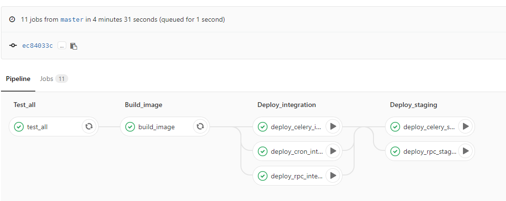
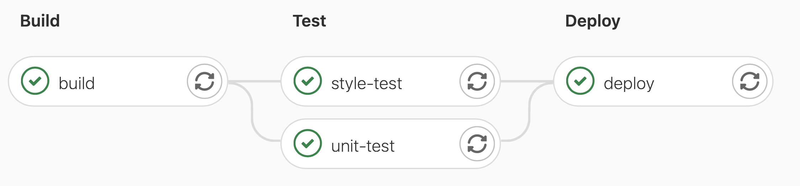

# GitLab CI/CD

**持续集成** (Continuous Integration, CI) 指在代码构建过程中持续地进行代码的集成、构建、测试等。通过 CI，我们可以在开发过程中尽早发现引入的错误，并进行代码的静态检查和部署镜像的构建等等。**持续部署** (Continuous Deployment, CD) 指代码构建完毕之后，将构建的版本部署上线的流程。通过 CD，我们可以快速对应用进行迭代和交付。

SECoder 平台的 GitLab 提供了集成的 CI/CD 系统，可以通过项目仓库的 `.gitlab-ci.yml` 配置 CI/CD 流程，在特定时机自动执行。

!!! warn "在大作业中使用小作业框架时请注意"

    在大作业阶段，部署需要使用的环境变量将由 SECoder 预设，你不需要手动设置。在本次小作业中为你预设了个人 deployer 环境，在大作业中请移去 `.gitlab-ci.yml` 中 `deploy` 作业的 `export DEPLOY_ENV=...` 命令以使用团队环境。

    简单来说，你可以直接使用如下的 `deploy` 阶段：

    ```yaml
    deploy:
      stage: deploy
      script:
        - deployer dyno replace $CI_PROJECT_NAME "$CI_REGISTRY_IMAGE:$CI_COMMIT_REF_SLUG" "$REGISTRY_USER" "$REGISTRY_PWD"
      only:
        - main
    ```

## 基本概念

以下是一个 GitLab CI/CD 流水线，我们将以它为例说明 GitLab CI/CD 中的一些基本概念。



### 作业 (Job)

作业是 CI/CD 流程的最小执行单元，一个作业包含了一系列需要执行的命令。每个作业需要指定一个 **Docker 镜像**，在执行 CI/CD 时将会基于此镜像运行一个容器，在其中执行命令。例如，上图中的 `test_all` 和 `build_image` 等就是一些作业。

!!! note

    由于这里的 image 也是 Docker 镜像, 它也会受到 Docker 默认 Registry 无法使用的影响. 不过助教团队会尽量减轻此问题.

作业的成功状态将取决于其命令的执行结果。若执行过程中某条命令返回值非零，则此作业执行失败。所有命令返回值均为零时作业执行成功。在 GitLab 的 CI/CD 界面可以查看每个作业的状态以及运行过程的输出。

!!! note

    Shell 脚本即使其中某一条命令返回值非零仍会继续执行之后的命令，脚本的返回值取决于最后一条命令的返回值，这与 GitLab CI/CD 作业的逻辑不同。

### 阶段 (Stage)

CI/CD 流程划分为多个阶段分别进行，每个阶段可以包含一个或多个作业。同一个阶段的多个作业可以并行执行。只有一个阶段的所有作业均成功执行后，才会执行下一个阶段的作业。上图中 `Build_image` 和 `Deploy_integration` 等就是不同的阶段，只有 `Deploy_integration` 阶段的三个作业全部成功后才会执行 `Deploy_staging` 阶段。

### 流水线 (Pipeline)

多个阶段顺序连接组成一个流水线。将代码推送到远程仓库或是发起合并请求时，GitLab 会基于该版本的代码执行流水线。

## `.gitlab-ci.yml`

GitLab 会通过仓库根目录下的 `.gitlab-ci.yml` 读取 CI/CD 配置，并基于此建立流水线。

??? note "YAML 速览"

    **YAML** (YAML Ain't Markup Language) 是一种人类友好的数据序列化语言，也常被用于配置文件。关于其具体格式，可以参考 [YAML 官网](https://yaml.org)和 [YAML 入门教程](https://www.runoob.com/w3cnote/yaml-intro.html)。在这里，我们简要介绍 YAML 最常用的要素。

    - **对象**：一个对象由一系列冒号分隔的键值对组成。键和值都可以由任何类型的值组成，包括嵌套的子对象。整个文件定义了一个对象，因此文件顶层的键值对就是该对象的属性。
    - **子对象**：YAML 使用缩进层级来表明对象的嵌套层级。因此，在一个键之后的缩进一级的行会被认为是该键对应的值。
    - **字符串**：与 JSON 不同，多数情况下，字符串不需要加引号。字符串可以是多行的，换行会被转换为空格。
    - **数组**：以 `- ` (连字符 + 空格) 开头的一系列行表示一个数组，每行是一个数组元素。

    下面是一份样例 YAML 文件：

    ```yaml
    foo: Hello, world!
    bar:
      software: engineering
    hw:
      - next
      - django
      - ci-cd
    ```

    以下是上述 YAML 定义的对象的 JSON 表示：

    ```json
    {
        "foo": "Hello, world!",
        "bar": {
            "software": "engineering"
        },
        "hw": ["next", "django", "ci-cd"]
    }
    ```

以下是一个 Python 项目的样例 CI/CD 配置，它包含了 GitLab CI/CD 配置的基本要素。我们将以它为例来讲解 CI/CD 配置的格式。

```yaml
image: registry.secoder.net/tool/deployer

stages:
  - build
  - test
  - deploy

build:
  stage: build
  script:
    - export BUILD_IMAGE_NAME=$CI_REGISTRY_IMAGE
    - export BUILD_IMAGE_TAG=$CI_COMMIT_REF_SLUG
    - export BUILD_IMAGE_USERNAME=$CI_REGISTRY_USER
    - export BUILD_IMAGE_PASSWORD=$CI_REGISTRY_PASSWORD
    - deployer build

.test:
  image: python:3.11
  stage: test

  before_script:
    - pip install -i https://pypi.tuna.tsinghua.edu.cn/simple -r requirements.txt
      coverage pytest pycodestyle pylint

unit-test:
  extends: .test

  script:
    - coverage run --source app -m pytest --junit-xml=xunit-reports/xunit-result.xml
    - ret=$?
    - coverage xml -o coverage-reports/coverage.xml
    - coverage report
    - exit $ret
  after_script:
    - SUFFIX=$RANDOM
    - curl "http://api.secoder.net/static/sonar-scanner.tar.gz" -s -o "/tmp/sonar-$SUFFIX.tar.gz"
    - tar -xf "/tmp/sonar-$SUFFIX.tar.gz"  -C /opt
    - /opt/sonar-scanner/bin/sonar-scanner

style-test:
  extends: .test
  allow_failure: true

  script:
    - pycodestyle app tests
    - PYCODESTYLE_RET=$?
    - pylint app tests
    - PYLINT_RET=$?
    - if [ $PYCODESTYLE_RET \> 0 ]; then exit $PYCODESTYLE_RET; fi;
    - exit $PYLINT_RET

deploy:
  stage: deploy
  script:
    - deployer dyno replace $CI_PROJECT_NAME "$CI_REGISTRY_IMAGE:$CI_COMMIT_REF_SLUG" "$REGISTRY_USER" "$REGISTRY_PWD"
  only:
    - main
```

可以看到，该配置首先指定了 SECoder 的 image registry 中的 `deployer` 镜像作为默认镜像。当没有在作业中显式指定镜像时，就会使用这个镜像。例如，这个流水线的 `build` 和 `image` 作业将使用 `deployer` 镜像进行项目的镜像构建与部署。

接下来，我们定义了 `build`、`test` 和 `deploy` 三个阶段。该配置将会形成如下图所示的流水线：



### `build`

```yaml
build:
  stage: build
  script:
    - export BUILD_IMAGE_NAME=$CI_REGISTRY_IMAGE
    - export BUILD_IMAGE_TAG=$CI_COMMIT_REF_SLUG
    - export BUILD_IMAGE_USERNAME=$CI_REGISTRY_USER
    - export BUILD_IMAGE_PASSWORD=$CI_REGISTRY_PASSWORD
    - deployer build
```

在作业中，我们通过 `stage` 属性指定作业所属的阶段。这里，`build` 作业属于 `build` 阶段。`script` 属性是一个数组，指定作业执行的命令，每个数组元素表示一条命令。

!!! note "预定义环境变量"

    GitLab 在执行流水线时，会定义一系列 CI/CD 相关的环境变量。完整的列表可以在 [Predefined environment variables reference](https://gitlab.secoder.net/help/ci/variables/predefined_variables.md) 找到。这里我们列出一些常用的预定义环境变量：

    |变量|说明|
    |-|-|
    |`GITLAB_USER_LOGIN`|GitLab 登录用户名，在 SECoder 平台上即学号|
    |`CI_PROJECT_NAME`|项目名称|
    |`CI_COMMIT_REF_SLUG`|当前分支/标签名|
    |`CI_REGISTRY_IMAGE`|项目的镜像名称|
    |`CI_REGISTRY_USER`|Registry 用户名|
    |`CI_REGISTRY_PASSWORD`|Registry 密码|

SECoder GitLab 配置了 image registry，因此在执行流水线时，将能够通过预定义的环境变量访问 registry 的用户名与密码。密码实际上是访问当前项目镜像的 token，因此你将只能够写入到项目对应的镜像中。在 `build` 作业中，我们将这些信息通过环境变量传递给 deployer，deployer 会根据项目的 Dockerfile 构建镜像并上传到 SECoder Image Registry 中。

### `test`

```yaml
.test:
  image: python:3.11
  stage: test

  before_script:
    - pip install -i https://pypi.tuna.tsinghua.edu.cn/simple -r requirements.txt
      coverage pytest pycodestyle pylint
```

`test` 阶段定义了 `unit-test` 和 `style-test` 两个作业。

由于这两个作业有一些共同之处，我们首先定义了一个作业模板 `.test`。以 `.` 开头的作业将不会真正执行。在 `unit-test` 和 `style-test` 作业中，我们使用 `extends` 属性指定模板，这将继承模板的属性，除非在当前作业中显式覆盖。

我们首先通过 `image` 属性指定镜像为 `python:3.11`，这会覆盖全局的镜像设置。

`before_script` 将会在作业的 `script` 之前执行。在 `before_script` 中，我们根据项目的 `requirements.txt` 安装依赖，同时还安装了测试和代码风格检查需要的 `coverage`、`pytest`、`pycodestyle`、`pylint` 等库。

#### `unit-test`

```yaml
unit-test:
  extends: .test

  script:
    - coverage run --source app -m pytest --junit-xml=xunit-reports/xunit-result.xml
    - ret=$?
    - coverage xml -o coverage-reports/coverage.xml
    - coverage report
    - exit $ret
  after_script:
    - SUFFIX=$RANDOM
    - curl "http://api.secoder.net/static/sonar-scanner.tar.gz" -s -o "/tmp/sonar-$SUFFIX.tar.gz"
    - tar -xf "/tmp/sonar-$SUFFIX.tar.gz" -C /opt
    - /opt/sonar-scanner/bin/sonar-scanner
```

这一作业执行单元测试。

在 `script` 中，我们利用 `coverage` 和 `pytest` 执行单元测试并生成测试报告和覆盖率报告。生成的报告会被 SonarQube 用于代码质量分析，这一点我们将在介绍 SonarQube 时展开介绍。

`after-script` 会在 `script` 之后执行，注意作业的执行成功状态仍取决于 `script` 最后一条命令的执行结果。在 `after-script` 中，我们通过 SonarScanner 扫描项目，使单元测试结果和代码静态检查结果能够被 SonarQube 记录。为了兼容性，我们将直接下载 SECoder 提供的 SonarScanner。

#### `style-test`

```yaml
style-test:
  extends: .test
  allow_failure: true

  script:
    - pycodestyle app tests
    - PYCODESTYLE_RET=$?
    - pylint app tests
    - PYLINT_RET=$?
    - if [ $PYCODESTYLE_RET \> 0 ]; then exit $PYCODESTYLE_RET; fi;
    - exit $PYLINT_RET
```

这一作业执行代码风格检查。`script` 通过 `pycodestyle` 和 `pylint` 两种代码风格检查工具进行了检查。实际开发中，可以根据团队的开发规范选择自己需要的工具进行配置。

我们可以为作业指定 `allow_failure` 属性来允许这一作业的失败，即使作业失败也能够执行下一阶段。

### `deploy`

```yaml
deploy:
  stage: deploy
  script:
    - deployer dyno replace $CI_PROJECT_NAME "$CI_REGISTRY_IMAGE:$CI_COMMIT_REF_SLUG" "$REGISTRY_USER" "$REGISTRY_PWD"
  only:
    - main
```

`deploy` 作业通过调用 `deployer` 将 SECoder 平台上该项目部署的容器替换为以我们在 `build` 作业中构建的镜像运行的容器。`REGISTRY_USER` 与 `REGISTRY_PWD` 环境变量是 SECoder 预定义的，它拥有对当前团队镜像的只读访问权限。

我们还通过 `only` 属性指定仅在 `main` 分支执行这一作业。这样，我们就可以在其他分支进行开发，而不影响应用部署的版本。

!!! note

    Gitlab CI 是可以取消的. 如果 CI 时间过长 (比如忘记配置 npm mirror 导致的网络缓慢问题), 可以直接取消此次 CI. 如果 CI 因为奇怪的问题 (如网络问题) 运行失败, 也可以 Rerun CI.

## 参考资料

你可以在 [GitLab CI/CD](https://gitlab.spring25a.secoder.net/help/ci/README.md) 更详细地学习 GitLab CI/CD 系统的使用方法。(或者 [Spring 25 B](https://gitlab.spring25b.secoder.net/help/ci/README.md), [Tsinghua Git](https://git.tsinghua.edu.cn/help/ci/yaml/index.md))

在本课程提供的[样例项目](https://git.tsinghua.edu.cn/SEG/example)仓库中也可以找到几种常见项目框架的 CI/CD 配置，可供配置部署时参考。需要注意的是，这些样例项目都较为老旧，请在参考时注意版本和兼容性等问题。