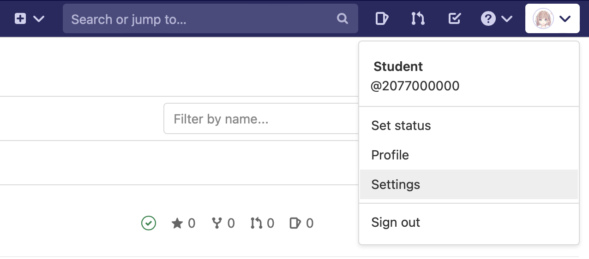
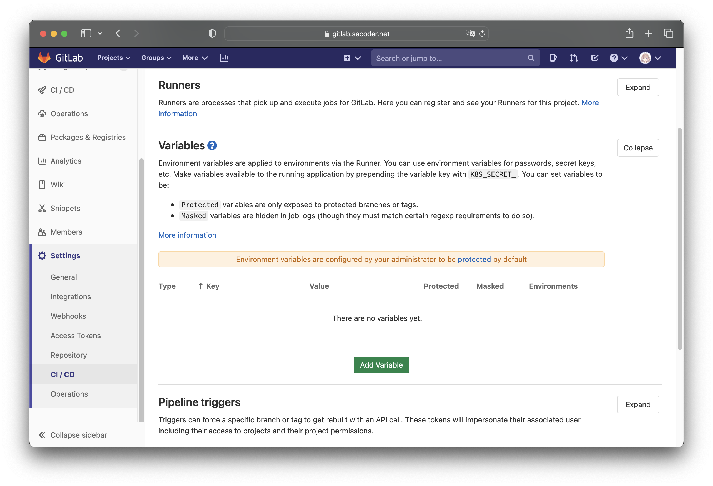

# CI/CD 小作业文档

本作业目标为将前后端小作业成功部署到 SECoder 平台，并能够通过网址进行正常的访问与游玩。

开始 CI/CD 小作业前，请阅读课程文档“部署基础”部分中的 [Docker](../../deploy/docker)、[Deployer](../../deploy/deployer) 与 [GitLab CI/CD](../../deploy/gitlab-ci)。

## 提交方式

本次作业需要在 SECoder GitLab 上完成。每个任务的分值在对应任务给出，直接计入课程总评。

由于 SECoder 平台资源限制，我们将通过人工验收的方式来检查后端 CI/CD 小作业。我们会检查你的代码并在本地构建和运行镜像，并测试能否正常与容器中的后端通信来确认你是否完成了任务。

由于前端小作业的检查依赖于你在 SECoder 上的部署，原则上若前端小作业检查时你的部署正常，前端 CI/CD 作业的非思考题部分你将获得满分，虽然我们会检查你的代码来确认你确实按照作业文档的要求完成了任务，包括只修改了限定部分的代码以及完成了各个任务的额外要求等。若不能正常访问部署，我们会通过检查你的代码来判定每个任务的得分。

本次作业中会有一些思考题，请将你的答案提交到网络学堂。

!!! note "需要修改的代码"

    在本次小作业的每个任务中，都会有“需要修改的代码”部分来提示你需要修改的文件及行号，你只需要修改这些代码即可完成任务。

    除非特别声明，你可以在不改动这些部分的行数的情况下完成任务。任意地扩充或缩减 TODO 部分的行数是被允许的，不过这可能造成同一文件后续的 TODO 部分的行号与作业文档中提供的不一致。

!!! note "部署密钥和 registry 密钥"

    由于小作业为个人项目，我们会为每位同学创建 deployer 环境并将部署密钥通过网络学堂下发。
    
    除此之外，你还需要自己生成拥有 SECoder Image Registry 读取权限的 registry 密钥。生成方法如下：

    1. 进入 GitLab 的 Settings 页面

        

    2. 在 Access Tokens 选项卡中生成密钥，名字任意，过期时间不早于本课程结课时间，权限选择 `read_registry`，点击 “Create personal access token”

        

    3. 妥善保存生成的密钥

        

    接下来，你需要将 **registry 密钥**和**下发的部署密钥**加入到项目的 CI/CD 变量中。

    1. 进入项目设置的 “CI/CD” 部分

        

    2. 点击 “Add variable”，Key 填写 `REGISTRY_PWD`，Value 填写你的 registry 密钥，点击 “Add variable”

        

    3.  点击 “Add variable”，Key 填写 `DEPLOY_TOKEN`，Value 填写网络学堂下发的部署密钥，点击 “Add variable”

        

    请注意，默认情况下只有受保护的分支才能够在 CI/CD 流水线中获得这些变量，因此你需要将 `main` 分支设为受保护才能正常部署。

    你需要在前端与后端两个项目**都**添加这些变量以正常部署。
    
!!! warn "在大作业中使用小作业框架时请注意"

    在大作业阶段，前面提到的环境变量将由 SECoder 预设，你不需要手动设置。同时，我们在本次小作业中为你预设了个人 deployer 环境，在大作业中请移去 `.gitlab-ci.yml` 中 `deploy` 作业的 `export DEPLOY_ENV=...` 命令以使用团队环境。

    简单来说，大作业中你可以直接使用如下的 `deploy` 阶段：

    ```yaml
    deploy:
      stage: deploy
      script:
        - deployer dyno replace $CI_PROJECT_NAME "$CI_REGISTRY_IMAGE:$CI_COMMIT_REF_SLUG" "$REGISTRY_USER" "$REGISTRY_PWD"
      only:
        - main
    ```