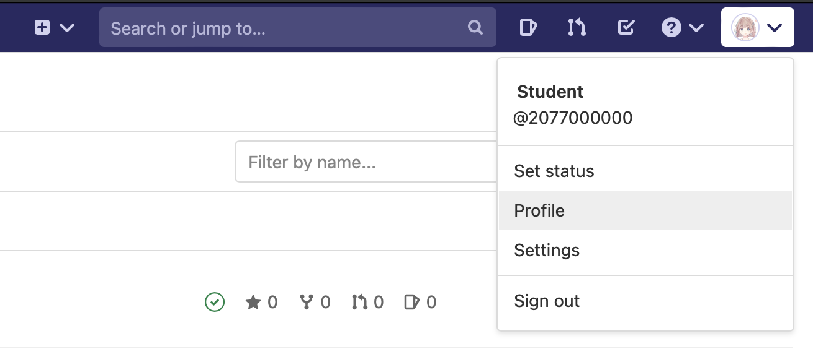

# CI/CD 小作业文档

本作业目标为将前后端小作业成功部署到 SECoder 平台，并能够通过网址进行正常的访问与游玩。

开始 CI/CD 小作业前，请阅读课程文档“部署基础”部分中的 [Docker](../../deploy/docker)、[Deployer](../../deploy/deployer) 与 [GitLab CI/CD](../../deploy/gitlab-ci)。

本次作业需要在 SECoder GitLab 上完成。本次作业中会有一些思考题，请将你的答案提交到网络学堂。

**建议路线**：

1. 完成后端小作业
2. 完成后端部署
3. 完成前端小作业
4. 完成前端部署

!!! note "需要修改的代码"

    在本次小作业的每个任务中，都会有“需要修改的代码”部分来提示你需要修改的文件及行号，你只需要修改这些代码即可完成任务。

    理论上你可以任意地扩充 TODO 部分的行数，不过这可能造成同一文件后续的 TODO 部分的行号与作业文档中提供的不一致。

!!! note "部署密钥和 registry 密钥"

    由于小作业为个人项目，我们会为每位同学创建 deployer 环境并将部署密钥通过网络学堂下发。
    
    除此之外，你还需要自己生成拥有 SECoder Image Registry 读取权限的 registry 密钥。生成方法如下：

    1. 进入 GitLab 的 Profile 页面

        

    2. 在 Access Tokens 选项卡中生成密钥，名字任意，过期时间不晚于本课程结课时间，权限选择 `read_registry`，点击 “Create personal access token”

        

    3. 妥善保存生成的密钥

        

    接下来，你需要将 registry 密钥和下发的部署密钥加入到项目的 CI/CD 变量中。

    1. 进入项目设置的 “CI/CD” 部分

        

    2. 点击 “Add variable”，Key 填写 `REGISTRY_PWD`，Value 填写你的 registry 密钥，点击 “Add variable”

        

    3.  点击 “Add variable”，Key 填写 `DEPLOY_TOKEN`，Value 填写网络学堂下发的部署密钥，点击 “Add variable”

        

    请注意，默认情况下只有受保护的分支才能够在 CI/CD 流水线中获得这些变量，因此你需要将 `master` 分支设为受保护才能正常部署。

    你需要在前端与后端两个项目都添加这些变量以正常部署。在大作业阶段，这些变量将由 SECoder 预设，你不需要手动设置。