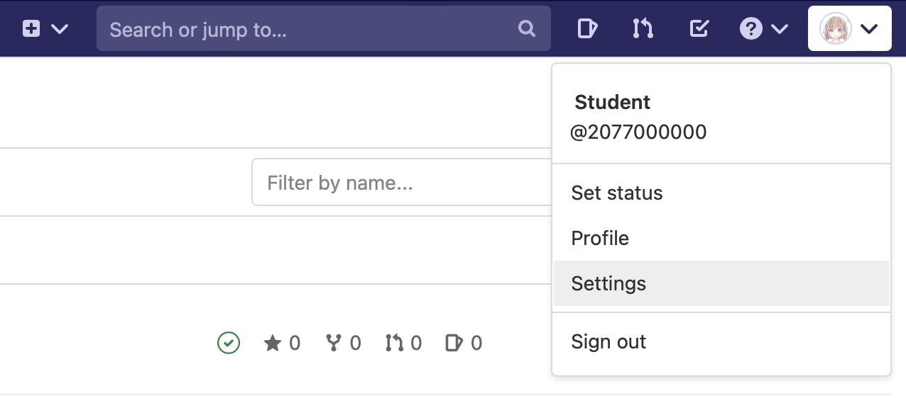
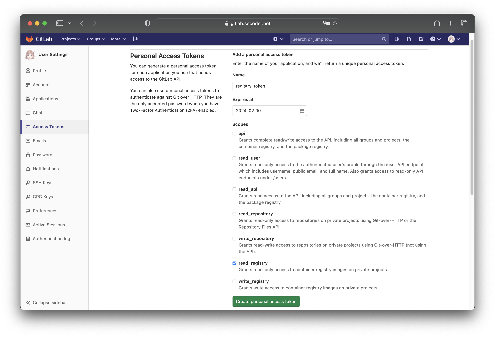
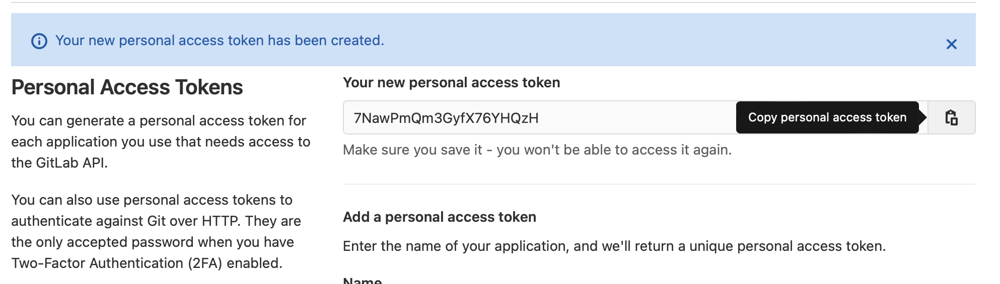
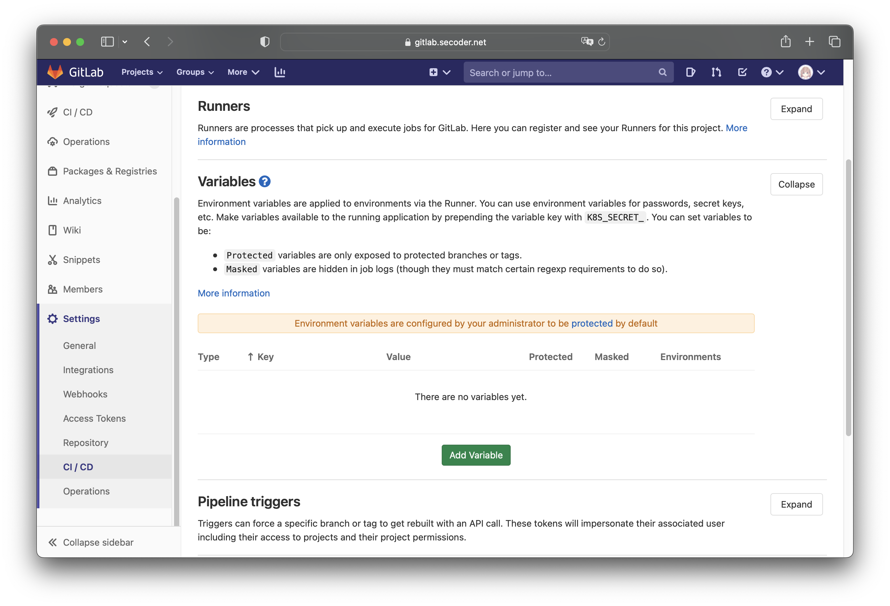
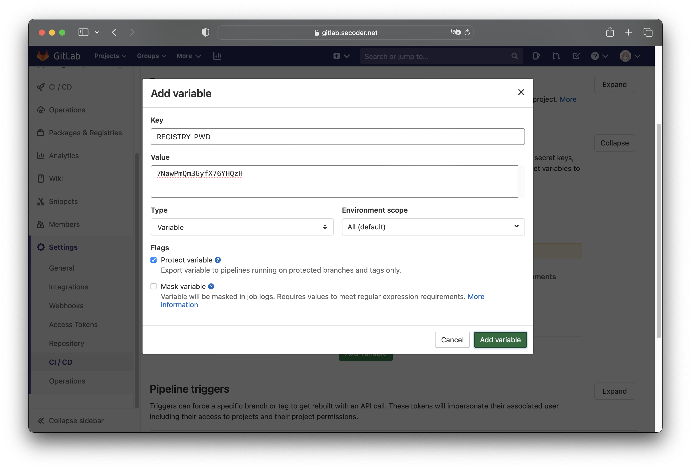
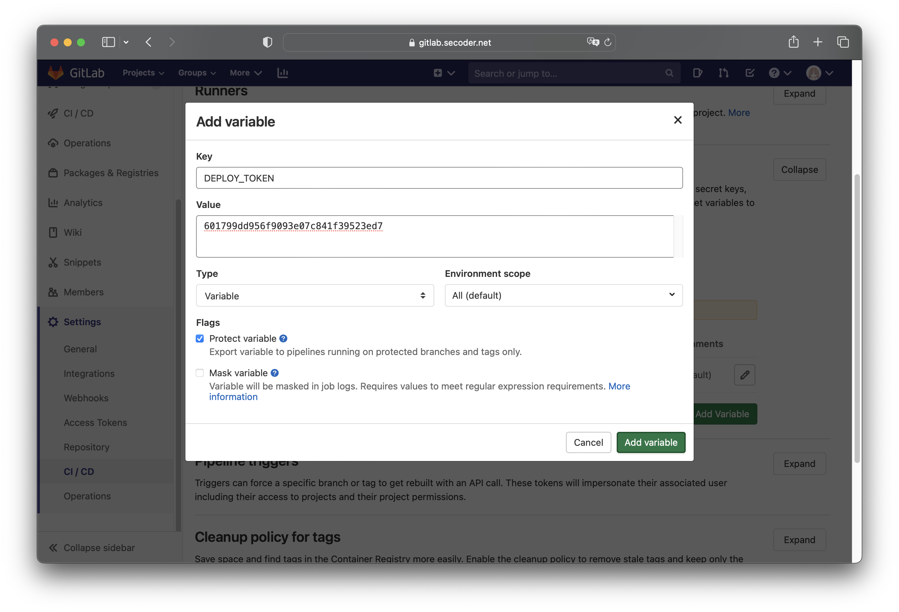

# CI/CD 小作业文档

本作业目标为将前后端小作业成功部署到 SECoder 平台，并能够通过网址进行正常的访问与游玩。

开始 CI/CD 小作业前，请阅读课程文档“部署基础”部分中的 [Docker](../../deploy/docker)、[Deployer](../../deploy/deployer) 与 [GitLab CI/CD](../../deploy/gitlab-ci)。

## 提交方式

本次作业需要在 SECoder GitLab 上完成，请按各任务说明实现并提交。

请你自行完成后端 CI/CD 小作业自查：检查代码，并在本地构建和运行镜像，测试能否正常与容器中的后端通信。

前端小作业建议基于 SECoder 上的部署结果进行自查。若部署可正常访问，再对照文档核对代码是否按要求完成（包括是否仅修改限定部分、是否完成各任务额外要求等）；若部署暂时不可访问，则先通过代码与本地运行结果确认各任务完成情况。

本次作业中会有一些思考题，请将你的答案提交到网络学堂。

!!! note "需要修改的代码"

    在本次小作业的每个任务中，都会有“需要修改的代码”部分来提示你需要修改的文件及行号，你只需要修改这些代码即可完成任务。

    除非特别声明，你可以在不改动这些部分的行数的情况下完成任务。任意地扩充或缩减 TODO 部分的行数是被允许的，不过这可能造成同一文件后续的 TODO 部分的行号与作业文档中提供的不一致。

!!! note "部署密钥和 registry 密钥"

    由于小作业为个人项目，我们会为每位同学创建 deployer 环境并将部署密钥通过网络学堂下发。
    
    除此之外，你还需要自己生成拥有 SECoder Image Registry 读取权限的 registry 密钥。生成方法如下：

    1. 进入 GitLab 的 Settings 页面

        

    2. 在 Access Tokens 选项卡中生成密钥，名字任意，过期时间不早于本课程结课时间，权限选择 `read_registry`，点击 “Create personal access token”

        

    3. 妥善保存生成的密钥

        

    接下来，你需要将 **registry 密钥**和**下发的部署密钥**加入到项目的 CI/CD 变量中。

    1. 进入项目设置的 “CI/CD” 部分

        

    2. 点击 “Add variable”，Key 填写 `REGISTRY_PWD`，Value 填写你的 registry 密钥，点击 “Add variable”

        

    3.  点击 “Add variable”，Key 填写 `DEPLOY_TOKEN`，Value 填写网络学堂下发的部署密钥，点击 “Add variable”

        

    请注意，默认情况下只有受保护的分支才能够在 CI/CD 流水线中获得这些变量，因此你需要将 `main` 分支设为受保护才能正常部署。

    你需要在前端与后端两个项目**都**添加这些变量以正常部署。
    
!!! warn "在大作业中使用小作业框架时请注意"

    在大作业阶段，前面提到的环境变量将由 SECoder 预设，你不需要手动设置。同时，我们在本次小作业中为你预设了个人 deployer 环境，在大作业中请移去 `.gitlab-ci.yml` 中 `deploy` 作业的 `export DEPLOY_ENV=...` 命令以使用团队环境。

    简单来说，大作业中你可以直接使用如下的 `deploy` 阶段：

    ```yaml
    deploy:
      stage: deploy
      script:
        - deployer dyno replace $CI_PROJECT_NAME "$CI_REGISTRY_IMAGE:$CI_COMMIT_REF_SLUG" "$REGISTRY_USER" "$REGISTRY_PWD"
      only:
        - main
    ```
