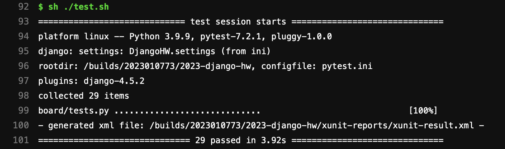

# 作业提交

## 提交方式

完成代码并按要求上传到 SECoder Gitlab 即可。

## 评分方式

功能评分通过 SECoder Gitlab CI 进行，我们将会以作业截止时间前主分支上最后一次 commit 对应的 CI 为基准评分。功能评分占后端小作业评分的 100%，通过作业框架提供的所有单元测试即记满分。有部分单元测试不通过的酌情扣分。

在已经完成了 CI/CD 作业的基础上，如果在 SECoder Gitlab CI 上查看到类似下述提示：

即表示你后端小作业获得满分（我们会检查你有没有修改测试脚本并且 CI 脚本填写正确等）。

若你未正确完成 CI/CD 小作业导致无法通过上述方式评分，我们会使用克隆仓库并本地运行单元测试等方式评分。
