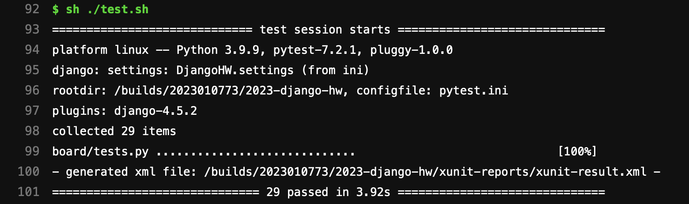

# 作业提交

## 提交方式

完成代码并按要求上传到 SECoder Gitlab 即可。

## 完成检查

请在作业截止时间前，确认主分支最后一次 commit 对应的 SECoder Gitlab CI 能够通过作业框架提供的单元测试。

在已经完成了 CI/CD 作业的基础上，如果在 SECoder Gitlab CI 上查看到类似下述提示：

即表示后端小作业测试通过（同时请自行确认没有修改测试脚本且 CI 脚本填写正确等）。

若你未正确完成 CI/CD 小作业导致无法通过上述方式检查，可以通过克隆仓库并在本地运行单元测试等方式自查功能完成情况。
