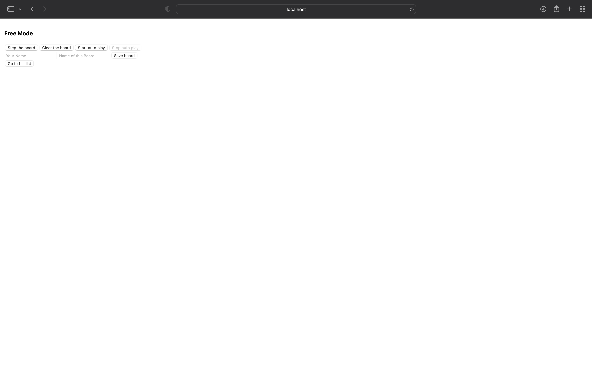

# 环境配置

!!! note "时效性文档"

    本文档是具有时效性的文档，为了保证内容准确应当保持更新。

    本文档的最后更新时间在页面最底部。

为了能够在本地正确运行我们下发的代码，请你按照本 Step 配置本地环境。

在配置环境中遇到问题，请首先检查这一问题是否已经在 FAQ 部分提出。如果这一问题并未出现在 FAQ 或者 FAQ 中提供的解决方案并不能解决问题，请在微信群或者网络学堂中提出。

我们推荐使用 Windows 系统的同学使用 WSL，配置 WSL 的方式请自行查阅相关资料。

## Node.js

Node.js 是服务器端运行 JavaScript 的环境，我们需要在本地配置 Node.js 环境以运行我们的前端代码。

对 Node.js 更为细节的介绍参考计算机系学生科协技能引导文档 <https://docs.net9.org/languages/node.js/>。

可以通过 [Node.js 官方中文网站](https://nodejs.org/zh-cn/) 下载并安装 Node.js，我们推荐下载**长期维护版本（Long Time Support）**，LTS 版本相较于最新版本往往更为稳定。

如果你是 WSL 用户，请在 [这个页面](https://nodejs.org/zh-cn/download/) 下载 Linux 二进制文件 (x64)：

```bash
mkdir ~/workspace && cd ~/workspace
wget https://nodejs.org/dist/v22.14.0/node-v22.14.0-linux-x64.tar.xz
tar -xf node-v22.14.0-linux-x64.tar.xz
cd node-v22.14.0-linux-x64/bin
pwd
```

请将这个输出的路径通过 `~/.bashrc` 文件手动添加到环境变量中：

```bash
# Append to the last line
export PATH=~/workspace/node-v22.14.0-linux-x64/bin:$PATH
```

之后通过以下命令重载终端配置：

```bash
source ~/.bashrc
```

<!-- 另外，为了获取更详细的安装指导，我们推荐获取安装包而非二进制文件，下载安装包后打开即可安装。 -->

为了确认是否正确安装，可以打开终端，输入指令 `node -v` 确认，如果输出版本号则代表安装成功。

## corepack & pnpm

目前 Node.js 上可以使用的包管理工具至少有三个主流选择，即默认的 npm 以及基于此优化的 yarn 和 pnpm，本课程通过对这三种包管理工具测试，推荐大家使用 pnpm。

然而由于包管理工具选择多样，所以 Node.js 官方使用了 corepack 工具来帮助大家管理包管理工具<del>（一层套一层没完了）</del>。然而由于 corepack 并不是默认启用，所以首先需要大家在下载 Node.js 后通过下述命令手动开启：

```bash
corepack enable
```

!!! warning "权限问题"

    你可能会遇到权限问题（比如提示你无权访问某些目录，多见于 Windows 系统），那么你可以在启动终端的时候右键选择“以管理员身份运行”并始终在这个终端内操作。

在项目的配置文件 `package.json` 中，会有 `packageManager` 字段指示 corepack 该项目使用具体那个版本的包管理工具：

```json
{
    "name": "conway-game",
    "version": "0.1.0",
    "private": true,
    "scripts": {
        "preinstall": "npx only-allow pnpm",
        // ...
    },
    "dependencies": { /* something */ },
    "devDependencies": { /* something */ },
    "packageManager": "pnpm@10.4.1+sha512.c753b6c3ad7afa13af388fa6d808035a008e30ea9993f58c6663e2bc5ff21679aa834db094987129aa4d488b86df57f7b634981b2f827cdcacc698cc0cfb88af"
}
```

本小作业推荐大家使用 pnpm，使用的版本固定为 10.4.1。在启用 corepack 之后，只要直接使用 `pnpm install` 之类的命令即可，corepack 会自动为你安装相应版本的 pnpm。

当然，本小作业也配置了 `scripts-preinstall` 字段，禁止大家使用 npm、yarn 之类的包管理工具。

## 本项目的配置

在配置完最基本的环境后，下一步可以将本次小作业 `git clone` 到本地，进入该项目的根目录作最后的配置。

下面我们简单讲解 pnpm 的使用方法：

```shell
pnpm install  # 自动安装依赖
pnpm add lodash  # 添加名为 lodash 的依赖
pnpm add -D lodash  # 添加开发环境下名为 lodash 的依赖（即生产环境下不使用该依赖）
pnpm remove lodash  # 删除名为 lodash 的依赖
pnpm dev  # 运行名为 dev 的脚本
```

而 pnpm 如何确定怎么自动安装依赖或者应当运行什么样的脚本，均会在项目根目录下 `package.json` 文件内定义。本次小作业的 `package.json` 文件节选为：

```json
{
    "name": "conway-game",
    "dependencies": { /* something */ },
    "devDependencies": { /* something */ },
}
```

其中 `dependencies` 与 `devDependencies` 字段定义了本项目所有的依赖名称以及版本要求，而 `devDependencies` 字段下的是开发环境的依赖。此时，在本项目根目录下运行 `pnpm install` 即会安装这里所列举的所有依赖。

现在运行 `pnpm install` 安装第三方依赖。本次小作业不需要在我们提供的第三方（已经列在 `package.json` 中）之外额外安装其他第三方依赖即可完成。

所有的第三方依赖将会安装在 `node_modules` 目录下，该目录应当已经被 `.gitignore` 忽略。

!!! warning "黑洞"

    `node_modules` 是一个文件结构十分复杂且庞大的文件夹，并且随着依赖迭代更新和包管理工具对其的维护，其内部的结构变动十分频繁，所以该目录非常不利于文件系统管理，故戏称为“黑洞”。

    另外，**切记在 `.gitignore` 内忽略该目录**，否则软工大作业刚开始一周内就在仓库里写了十几万行代码的，就有可能是你的小组。

之后，运行 `pnpm dev` 启动本次项目，项目启动后应当能在本地端口上访问到前端页面，默认端口号为 3000。

打开浏览器并在地址栏输入 `http://localhost:3000`（默认端口占用时需要替换端口号），即可访问到本次小作业前端页面。若能够看到类似于下图的界面，就说明环境配置完成，可以继续完成小作业了🎉：



!!! note "代码风格"

    本项目另外配置了 ESLint（所有规则基于 TypeScript 官方，详细配置文件见 `eslint.config.mjs`）用于诊断和修复代码风格，你可以在代码编辑器内安装 ESLint 插件以在编码的时候收到实时的编码风格提醒，或者在编码完成后运行 `pnpm fix` 命令修复所有代码风格。

    需要注意的是，在前端部署的时候我们会监测代码风格，不通过的话可能会部署失败，请务必注意。

!!! warning "热加载机制"

    React 是具有热加载机制的，即你只要修改代码并保存，代码上的变化应当立刻反应到 UI 上。**然而热加载机制可能在 WSL2 上失效**，具体请参考 [这个 Github Issue](https://github.com/microsoft/WSL/issues/6255)，只需将项目放到 WSL 自己的目录而非 /mnt/ 下即可。