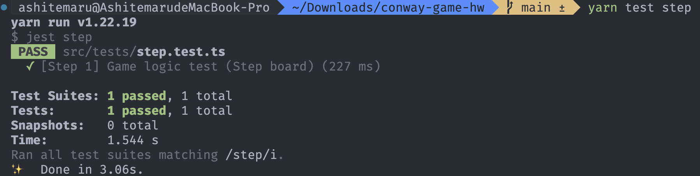

# TypeScript 初探与游戏逻辑

## 实验目标

通过本 Step，我们希望你能够掌握基本的 TypeScript 语法并且能够使用 TypeScript 语言编写完成康威生命游戏的核心逻辑。

## 实验步骤

你需要在 `src/utils/logic.ts` 文件的函数 `stepBoard` 之中，注释 `// Step 1 BEGIN` 与 `// Step 1 END` 之间的部分填充你的代码，编写完成康威生命游戏的核心逻辑。

本 Step 的代码量大约为 20 - 40 行。

在编写完成后，你可以在项目根目录下，运行命令 `pnpm test step` 执行我们编写好的单元测试，如果显示下述提示信息则代表你完成了 Step 1：



如果你在编写游戏的核心逻辑上遇到了困难，可以打开 `src/tests/step.test.ts` 文件，其中的 `stepBoardGT` 函数是我们提供的样例实现，也是最后评分所使用的对拍基准实现，可供本 Step 的参考。

### 代码说明

在 `src/utils/types.ts` 文件中，我们规定了表示棋盘的类型如下：

```typescript
export type Board = (0 | 1)[][];
```

这说明我们使用一个二维数组表示棋盘，二维数组中的每一个元素代表一个细胞，元素的取值为 `0` 或者 `1`，分别代表细胞死亡与细胞存活。

你需要填充的 `stepBoard` 函数接收一个 `Board` 类型的参数 `board`，其表示这个时刻的棋盘状态。该函数的返回值为 `Board` 类型，其表示下一时刻的棋盘状态。

在完成本 Step 的时候可以使用在 `src/constants/constants.ts` 文件中定义的常量，如描述棋盘尺寸的常量：

```typescript
export const BOARD_LENGTH = 50;
```

## 实验评分

本 Step 总分为 10 分。

Step 1 与 Step 3 的一部分采用自动化评分。在正确完成 CI/CD 小作业的基础上，你应当能在 SECoder Gitlab CI 上观察到单元测试所输出的信息。如果完全通过，显示应当类似于：


如果仅通过 Step 1 与 Step 3 中的某一个，显示应当类似于：


只要上述信息中显示 Step 1 测试通过，本 Step 即满分。

若你未正确完成 CI/CD 小作业导致无法通过上述方式评分，我们会使用克隆仓库并本地运行单元测试等方式评分。

## 知识讲解

详细的 TypeScript 语法可以参考 [TypeScript 的官方语法文档](https://www.typescriptlang.org/docs/)。作为已经有一定 C/C++ 语言基础的计算机系同学，可以参考较为简略的 [计算机系科协技能引导文档 TypeScript 部分](https://docs.net9.org/languages/typescript/)。

如果你只想快速上手本作业，并不想完整学完 TypeScript 语法后再完成作业，这里我们提供一个更简略的 TypeScript Cheatsheet。

- 变量声明

```typescript
const caption: string = "This is a string"; // 声明一个字符串类型的常量
let val: number = 1; // 声明一个数字类型的变量
val = 2; // 给变量 val 赋予新值

const youKnowIt = true; // 编译器能自动推测的类型可以省略类型标注

val = "A string"; // ERROR! 不能给变量赋予不符合其类型声明的值
caption = "This is another string"; // ERROR! 不能修改常量

const oneValue: 1 = 1; // 可以使用字面量作为类型标注
const foo: number | string = "Maybe string"; // 可以用 | 运算符实现联合类型

const templateStr: string = `An example: ${val + 1}`; // 模板字符串，用反引号标记，用 ${} 标记需要嵌入字符串的变量
```

- 运算与控制流

```typescript
// 一般的运算符与 C++ 语法近似
1 > 2; // false
1 <= 4; // true
1 + 3 > 2; // true

// 判定相等和不相等务必使用 === 和 !== 以防止意料外的类型转换
1 == true; // true
1 === true; // false

// 控制流的写法与 C++ 语法近似
const foo: number = 3;
if (foo !== 2) {
    console.log("foo is not 2");
}

for (let i = 0; i < 10; ++i) {
    console.log(`Now, i is ${i}`);
}
```

- 数组与对象

```typescript
const arr: number[] = [1, 2, 3, 4]; // 在类型后面加上 [] 表示这个类型的值构成的数组
const mat: number[][] = [[1, 2], [3, 4]]; // 二维数组则如此表示
const tuple: [number, string] = [1, "TS"]; // 元组则如此表示

// 接口可以用来作为对象的类型标记
// TS 中对象指的是键值对的组合，类似于 Python 的字典
interface Bar {
    foo: number;
    bar: string;
    foobar: number[];
}

// 由某一个接口标记的对象中每一个键值对都需要符合接口的约束
const barfoo: Bar = {
    foo: 1,
    bar: "Test string",
    foobar: [1, 2, 3],
};
```

另外一定要注意在访问数组或者对象的内部元素的时候可能出现的 `undefined`：

```typescript
const arr: number[] = [1, 2, 3, 4];
arr[0]; // 1
arr[100]; // undefined

const obj: any = {
    foo: 1,
    bar: "bar",
};
obj.foo; // 1
obj.barbar; // undefined
```

- 声明函数

```typescript
// 最为经典的声明函数的方式
function sum(x: number, y: number): number {
    return x + y;
}

// 箭头函数，另外一种声明函数的方式，与经典方法基本类似
const sum = (x: number, y: number): number => {
    return x + y;
}
```

- 数组的常用方法

这里涉及到回调模式这一在 JavaScript 中得到广泛应用的模式，这一模式的介绍可以参考 [技能引导文档的介绍](https://docs.net9.org/languages/javascript/function/#_3)。

```typescript
const arr: number[] = [1, 2, 3, 4, 5];

arr.forEach((val, ind) => {
    console.log(`The value at index ${ind} is ${val}.`);
}); // 遍历数组，回调函数第一个参数是数组的值，第二个参数是数组下标
arr.map((val) => val * val); // 映射数组，该语句得到 [1, 4, 9, 16, 25]
arr.filter((val) => val % 2 === 0); // 筛选数组，该语句得到 [2, 4]

arr.push(6); // 在尾部添加元素
arr; // [1, 2, 3, 4, 5, 6]
```

- 面向对象

TypeScript 中的 OOP 语法与 C++ 中的类似，这里给出一个例子，覆盖了声明类成员和访问权限、声明构造函数、声明成员函数和静态方法等基本语法。

```typescript
class Complex {
    private real: number;
    private imaginary: number;

    constructor(_real: number, _imaginary: number) {
        this.real = _real;
        this.imaginary = _imaginary; // Declare members & initialize
    }

    print() {
        console.log(`${this.real} ${this.imaginary >= 0 ? "+" : "-"} ${Math.abs(this.imaginary)} i`);
    }

    static printInfo() {
        console.log("This is a complex class.");
    }
}

let com = new Complex(1, 2);
com.print(); // "1 + 2 i"
Complex.printInfo(); // "This is a complex class."
```