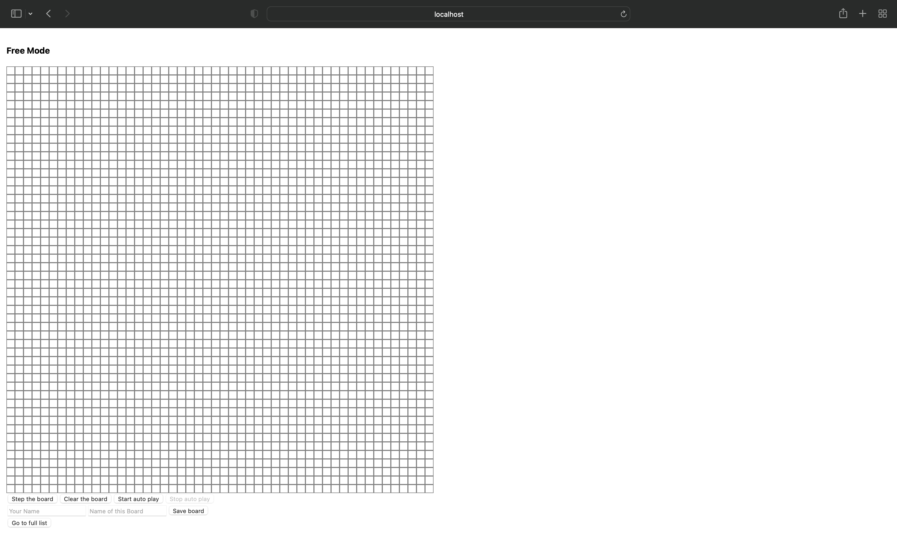

# 绘制游戏界面

## 实验目标

通过本 Step，我们希望你能够掌握 React 框架的基本使用，学会使用属性传递参数并且编写完成康威生命游戏的界面。

## 实验步骤

首先，你需要理解 React 中组件的概念，并理解如何使用属性来控制组件的显示方式。

之后，你需要在 `src/components/BoardUI.tsx` 文件的组件 `BoardUI` 之中，**两处**注释 `// Step 2 BEGIN` 与 `// Step 2 END` 之间的部分填充你的代码，使得屏幕上能够出现一个 $50 \times 50$ 的灰色边框棋盘，棋盘中细胞的背景色根据细胞的状态确定，若死亡则为白色，若存活则为红色。

本 Step 两处填空的代码量均在 5 行以内。

完成本 Step 后，参考的界面如下。由于在完成后续 Step 之前棋盘上所有细胞均处于死亡状态，所以所有细胞均为白色背景色：



### 实验提示

- 标签 `<div />` 的 `style` 属性中 `flexDirection` 字段决定了所有子元素按照何种方式排列
- 为了让 React 能够追踪一个列表之中各个元素的动态，需要在合适的地方添加 `key` 属性，该属性的详细介绍可见 [React 官方文档](https://reactjs.org/docs/lists-and-keys.html#keys)

### 代码说明

`src/components/Square.tsx` 文件中包含一个 `Square` 组件，其会绘制一个长宽均为 `16`，边框为宽为 `1` 的灰色实线的正方形，其背景色由属性中的 `color` 字段指定。你可以在完成本 Step 的时候引用该组件。

组件 `BoardUI` 所接受的参数格式定义在接口 `BoardUIProps` 中，其中 `board` 字段记录了当前棋盘上每个细胞的状态。

## 实验评分

本 Step 总分为 5 分。

本 Step 采用人工评分。由于该界面的细节可能会在后续的 Step 中修改，我们会查看截止时间前最后一次部署后游戏主界面是否满足：

- 存在一个 $50 \times 50$ 的棋盘
- 该棋盘具有灰色实线边框
- 打开控制台后没有类似下图的 warning


上述三个条件均满足，则你获得本 Step 所有分数。如果前两个条件有一不满足，则你本 Step 评为 0 分。如果仅有第三个条件不满足，则你本 Step 评为 3 分。

## 知识讲解

由于 [技能引导文档](https://docs.net9.org/frontend/react/) 是基于类组件这一概念讲解 React 框架，而本小作业是基于函数组件的，若你希望对 React 框架有更为深入的理解可以在完成本小作业后阅读技能引导文档中对类组件和生命周期等的介绍。

首先简单介绍 React 所引入的 TSX 语法扩展（这也是涉及到 React 的 TypeScript 文件扩展名为 `.tsx` 的原因），TSX 语法扩展的重点在于引入标签语法，即在 TypeScript 中使用类似 HTML 的标签语法编写组件，标签本身就是一个对象，同时也支持类似 HTML 语法的标签嵌套：

```typescript
return <div> This is a simple div. </div>;

return (
    <div className="container">
        <p> A paragraph in a div container. </p>
    </div>
);
```

在 TSX 中，可以在标签语法内使用大括号 `{}` 包围任何合法的 TypeScript 表达式，该表达式结果会嵌入至标签语法之中：

```typescript
const increase = (x: number): number => x + 1;
const color: string = "white";

return (
    <div className="container" style={{ backgroundColor: color }}>
        <p> 2 plus 1 is {increase(2)}. </p>
    </div>
);
```

大括号嵌入的一个重要应用是渲染一个组件的列表。React 允许我们事先构建一个标签的列表，之后使用大括号嵌入将这个标签列表嵌入到某一个容器之中，此时这个列表中的所有标签会按照列表的顺序成为该容器的子元素。这也是本 Step 需要你去理解的核心语法：

```typescript
const arr = [
    <div key={1}> The element 1. </div>,
    <div key={2}> The element 2. </div>,
    <div key={3}> The element 3. </div>,
];

return (
    <div className="container">
        <div key={0}> The element 0. </div>
        {arr}
        <div key={4}> The element 4. </div>
    </div>
);
```

但需要注意的是，由于 React 会追踪更新的元素并进行部分更新，对于一个数组渲染的节点，必须提供在兄弟节点间唯一的 key 作为区分，通常对于有 ID 的数据，我们可以直接使用 ID 作为 key。

函数组件的基本思路类似于一个渲染管道，其接受这个组件的**参数**（Properties，一般简称为 Props），也就是一系列描述这个组件显示方式的键值对。最终函数组件会返回一个 TSX 标签，定义这个组件会怎么渲染到屏幕上。

一个最为经典的无状态组件（**状态**这一概念后续说明）可以参考文件 `src/components/Square.tsx` 之中的 `Square` 组件，这也是自定义组件的最经典写法。首先使用接口定义这个组件所要接受的参数格式，最后在函数返回值里使用 TSX 标签语法写明该组件的显示方式。

在命名规则上，自定义组件命名最好首字母大写，与内置 HTML 标签名称全小写区分。

使用自定义组件的方式和使用内置 HTML 标签的方式并无差异，如使用带有 `color` 参数要求的自定义组件 `Square` 的写法即：

```typescript
return <Square color="red" />;
```