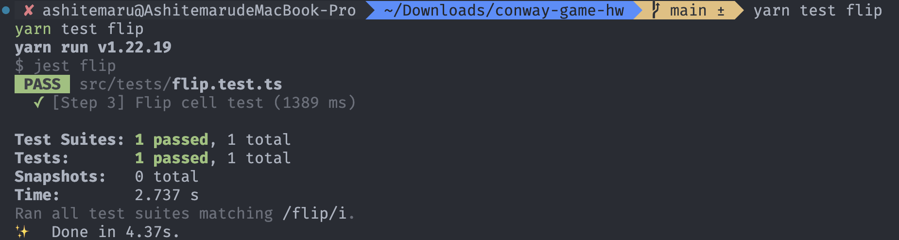

# 管理状态与全局资源

## 实验目的

通过本 Step，我们希望你能够掌握如何设定一个有状态的 React 组件以及如何通过回调函数处理各种事件，以及如何管理例如计时器等的全局资源，最终能够编写出一个能够通过点击棋盘切换细胞状态以及能够通过点击按钮或自动推进演变的康威生命游戏。

## 实验步骤

首先，你需要理解 React 中状态的概念，并对类似按钮等组件的 `onClick` 类似属性有基本的认识。同时，能够理解回调函数在处理事件之中的作用。

然后，你需要理解 React 中如何通过 `useRef` Hook 管理全局资源。

之后，你需要在两处完成代码填空。

第一处在文件 `src/utils/logic.ts` 文件的 `flipCell` 函数中，你需要在注释 `// Step 3 BEGIN` 与 `// Step 3 END` 之间的部分填充你的代码以实现切换棋盘中某一个给定细胞的状态（存活变为死亡，死亡变为存活）的功能。本处填空的代码量在 20 行以内。

为了确认第一处代码填空正确完成，可以运行命令 `pnpm test flip` 运行我们编写好的单元测试，如果显示下述提示信息则代表你完成了 Step 3 的第一处填空：



第二处在文件 `src/pages/index.tsx` 文件的 `BoardScreen` 组件中的 `switchAutoPlay` 函数，你需要在注释 `// Step 3 BEGIN` 与 `// Step 3 END` 之间的部分填充你的代码，以正确处理自动播放控制按钮的点击事件，并且能够正确管理计时器资源。本处填空的代码量在 10 行以内。

在完成填空后，目前的游戏应当具有下述功能：

- 点击棋盘上的某个细胞，能够切换其状态（存活变为死亡，死亡变为存活），并且棋盘能够实时反应这一变化（颜色能够跟随点击切换）
- 点击棋盘下方的按钮，能够推进一步演变
- 支持自由状态和自动播放状态的切换

完成本 Step 后，你的游戏主界面的交互应当和下述 GIF 图所展示的类似：


### 代码说明

需要注意，我们在 `flipCell` 函数中留有下述两行代码：

```typescript
throw new Error("This line should be unreachable.");
return board;
```

这两行代码的作用是，在你填入你的代码前，该函数是没有返回值的，此时 ESLint 会认为该函数返回值类型不符合其声明而报错。为了在你填写代码前这里不触发 ESLint Error，我们加入了这两行代码。不过，在你填入你的代码之后，这两行代码应当不可到达。

---

我们已经在 `BoardScreen` 组件内声明了 `timerRef` 引用，可以直接在此基础上完成你的代码。你需要在进入自动播放状态时创建计时器资源，并在结束自动播放状态时回收计时器资源。

创建一个周期计时器的方法为使用内置的 `setInterval` 函数，回收计时器则使用 `clearInterval` 函数。请自行使用搜索引擎查询这两个函数的使用方式完成本 Step。

---

`useState` Hook 的使用方式，在代码框架中以及下面的知识讲解部分有大量的示例，可以参照这些已有代码完成本 Step。

## 实验评分

本 Step 总分为 20 分。

本 Step 采用自动与人工混合评分。人工评分占 15 分，自动评分占 5 分。

人工评分中我们会查看截止时间前最后一次部署后游戏主界面，进行如下操作并评分：

- （3 分）在初始条件下，任意点击若干个不同的细胞，这些细胞均应该变为存活状态，颜色也应该相应改变
- （3 分）连续点击某一个细胞，该细胞应该不断在存活与死亡状态之间切换，颜色也应该相应改变
- （5 分）在自由状态通过点击棋盘设置好某一起始状态后点击 Start auto play 按钮能够进入自动播放状态，棋盘每次自动演变的间隔需要在 1 秒内（需求文档要求为 300 ms，检查时因无法精确计时故只要约在 1 秒内即可）
- （4 分）在自动播放状态下，点击 Stop auto play 按钮能够退回自由状态，自动演变停止，点击棋盘，其响应点击事件

Step 3 的一部分与 Step 1 采用自动化评分。在正确完成 CI/CD 小作业的基础上，你应当能在 SECoder Gitlab CI 上观察到单元测试所输出的信息。如果完全通过，显示应当类似于：


如果仅通过 Step 1 与 Step 3 中的某一个，显示应当类似于：


只要上述信息中显示 Step 3 测试通过，本 Step 自动评分即满分。

若你未正确完成 CI/CD 小作业导致无法通过上述方式评分，我们会使用克隆仓库并本地运行单元测试等方式评分。

## 知识讲解

我们已经讲解了一个无状态的组件如何编写，一个无状态的组件实际上类似于**纯函数**，即无论在什么条件下调用该组件，只要传入的参数一样，那么最后总是得到一样的结果。然而仅仅使用无状态组件显然是无法完成能够处理用户交互的 UI 的。

React 是允许组件具有状态的，并且允许编写相应的代码让用户的点击等行为触发状态的改变。

首先，在一个组件内声明该组件的状态的方式是使用 `useState` Hook，如文件 `src/pages/index.tsx` 中组件 `BoardScreen` 中的下述代码：

```typescript
const [id, setId] = useState<undefined | number>(undefined);
const [initBoard, setInitBoard] = useState(getBlankBoard());
const [board, setBoard] = useState(boardCache);
const [autoPlay, setAutoPlay] = useState(false);
const [recordUserName, setRecordUserName] = useState("");
const [boardName, setBoardName] = useState("");
const [refreshing, setRefreshing] = useState(false);
```

以第四行为例，该语句表明我们声明了一个名为 `autoPlay` 的，类型布尔值的状态，其初始值是 `false`。这里 `setAutoPlay` 是一个函数，可以使用该函数修改 `autoPlay` 的值，而 React 框架会在该函数调用后，由于组件状态发生改变，触发对该组件的重新渲染。该函数的调用方式有两种，第一种是直接传入新状态值，而遇到后续状态依赖于先前状态的场景的时候，则使用第二种，传入回调函数：

```typescript
setAutoPlay(true); // 第一种，直接传值
setAutoPlay((o) => !o); // 第二种，回调函数，回调函数参数为先前状态，返回值为后续状态
```

这里需要强调两点。

第一点是，如果使用直接传值的方式调用，则可能面临值消失的问题。比如：

```typescript
const [cnt, setCnt] = useState<number>(1);

setCnt(cnt + 1);
setCnt(cnt + 1);
```

该代码运行的结果是，最终 `cnt` 仅仅会变为 `2`。

该问题的解决方案是使用第二种调用方式，即传入回调函数，这就保证了符合预期的结果：

```typescript
const [cnt, setCnt] = useState<number>(1);

setCnt((cnt) => cnt + 1);
setCnt((cnt) => cnt + 1);
```

该问题的底层原理参见 <https://beta.reactjs.org/learn/state-as-a-snapshot>。

第二点是，如果更新后的状态与先前状态一致，则 React 会忽略本次更新导致的重新渲染。这里的“一致”，对于数字、字符串等基本类型指的是值相等，对对象等复杂类型指的是其引用指向同样的内存。React 框架这种为了性能而跳过重新渲染的机制可能会导致意料之外的结果。

为了处理用户的行为，如对某一个组件的点击行为，我们可以在类似 `<div />` 等的标签的 `onClick` 属性中定义一个回调函数，在这个函数中调用状态修改函数以更新组件状态：

```typescript
<div onClick={() => setCnt((cnt) => cnt + 1)}>
    You have clicked it for {cnt} times.
</div>
```

---

当我们需要管理一个全局资源的时候，比如说这个资源并不会因为组件重新渲染而需要重新设置等等，这个时候我们显然不能使用先前提到的 `useState` 管理这类对象，此时可以尝试使用 `useRef` Hook。

`useRef` 的基本使用场景是管理一个独立于组件的全局资源，如一个控制组件演变的计时器。其创建方式为：

```typescript
const ref = useRef(/* Init value */);
```

上述语句会创建开辟一片内存用于管理全局资源，并令引用 `ref` 指向这一片内存。我们可以方便地利用 `current` 属性（即使用 `ref.current` 表达式）访问到其指向的全局资源，以读取或者管理全局资源。另外，我们也可以方便地使用赋值语句来重新设置全局资源：

```typescript
ref.current = /* A new value */;
```

需要注意的是，对 `ref.current` 的任何修改都不会触发组件的重新渲染。

`useRef` 还有一种用途是用于管理庞大的状态。比如说某个页面需要显示新闻列表，那么新闻列表将会是一个相当庞大的状态，若使用 `useState`，则可能造成较大的性能压力。那么，将新闻列表作为全局资源管理在组件外，使用 `ref.current` 的方式访问该新闻列表是一种可行的方案。而为了让修改新闻列表时触发组件重新渲染，可以使用 `useState` 将最近一次新闻列表更新时间戳作为组件状态进行管理，每次新闻列表更新则修改时间戳以触发重新渲染。