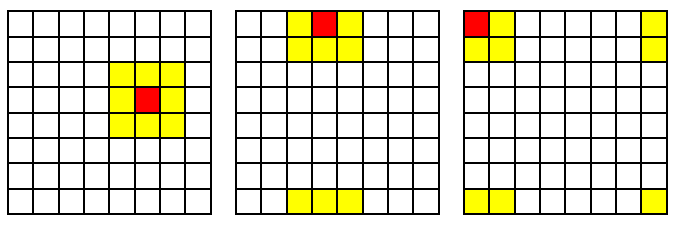
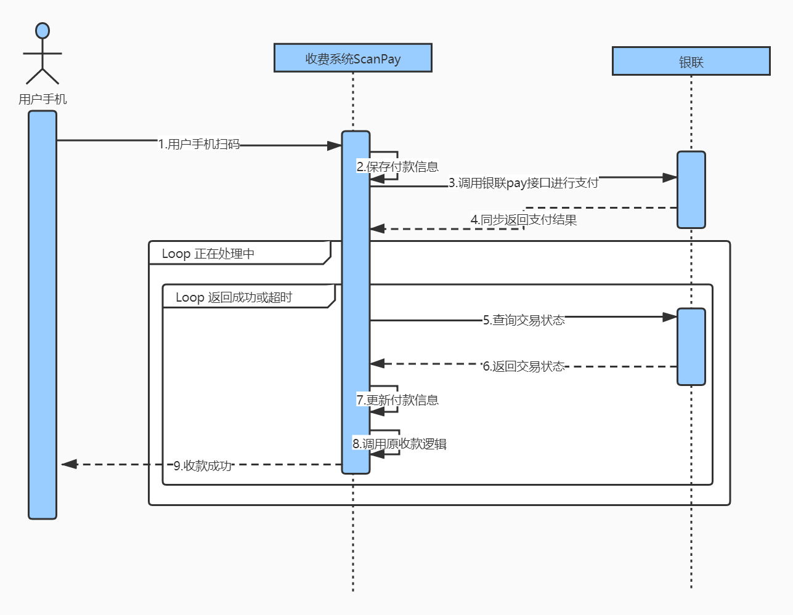
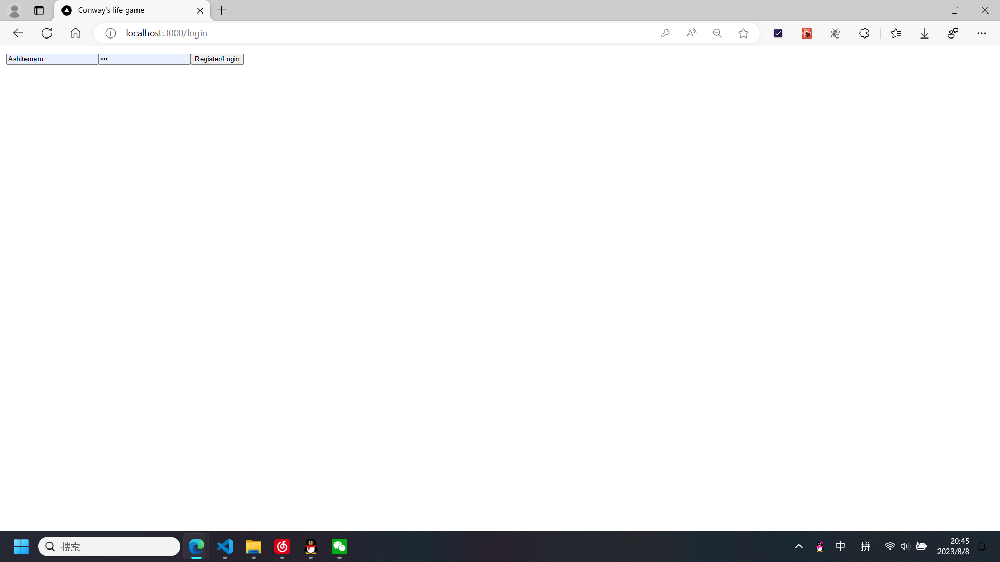
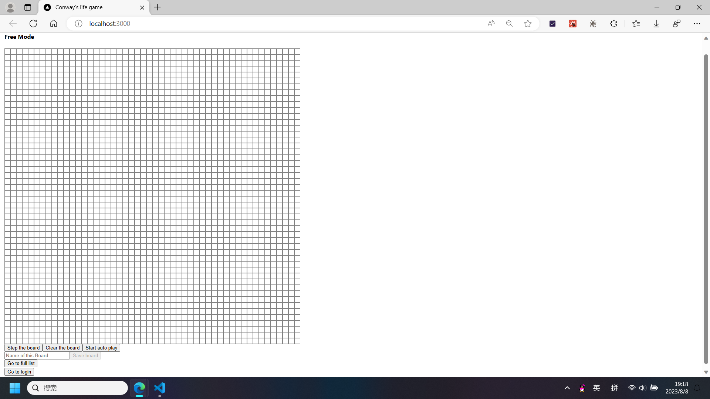
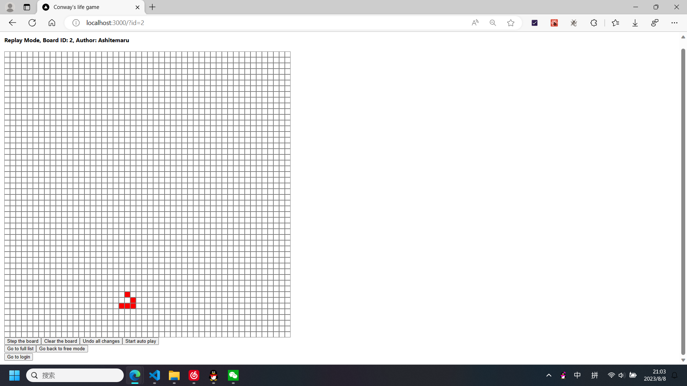
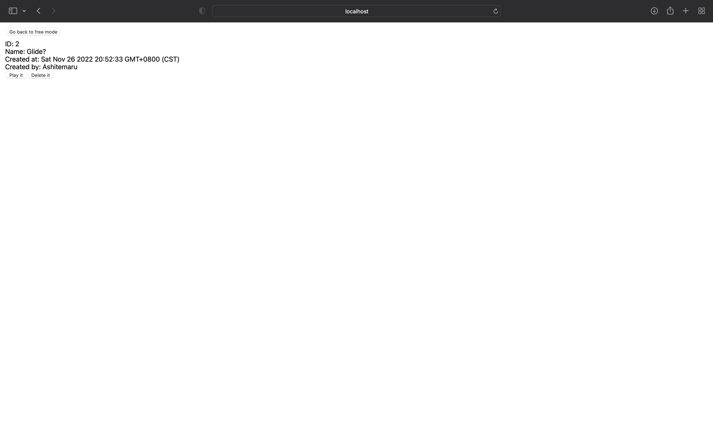

# 小作业需求文档

本次小作业的最终目标为实现一个带有记录管理功能的康威生命游戏，需要采用前后端分离的开发模式，并需要分别部署以供验收。

## 游戏规则

首先简要讲解康威生命游戏的规则。本作业中的康威生命游戏基于一个 $50 \times 50$ 的棋盘，棋盘上的每一个格子代表一个**细胞**。细胞具有两种状态，分别为**存活**以及**死亡**。

每个细胞在 $t + 1$ 时刻的状态取决于它自身在 $t$ 时刻的状态，以及其所有**邻居**在 $t$ 时刻的状态。每一个细胞都有 8 个邻居，这里由于棋盘大小有限，故采用循环相邻的定义方式。具体请看下图，这里用一个 $8 \times 8$ 的棋盘作为简化示例，对于每一个红色的细胞，8 个黄色的细胞称之为其邻居：

基于上述定义，每个细胞在下一个时刻的状态按照下述规则确定：

- 如果该细胞在这个时刻存活
    - （孤独死亡）如果其邻居中存活的个数不多于 1 个，则该细胞在下一时刻死亡
    - （人口超载）如果其邻居中存活的个数不少于 4 个，则该细胞在下一时刻死亡
    - （环境适中）如果其邻居中存活的个数为 2 个或者 3 个，则该细胞在下一时刻继续存活
- 如果该细胞在这个时刻死亡
    - （细胞繁殖）如果其邻居中存活的个数为 3 个，则该细胞在下一时刻存活
    - 其余情况下，该细胞保持死亡状态

所有细胞从这个时刻按照上述规则变换为下一时刻的状态称为一次**演变（英文：step）**。

这里我们提供一个示例网站，你可以在该网站上尝试游玩康威生命游戏，以加深对该游戏规则的理解（需要注意，该网站所实现的棋盘是无限的，与本作业要求的并不一致，并且部分交互也与我们要求不同）：

- 康威生命游戏示例网站 <https://playgameoflife.com/>

## 小作业需求

!!! note "需求是什么"

    需求描述了甲方希望开发者应当按照何种要求完成产品，一般较为完善的需求文档都需要对：
    
    - 前端设计
        - 重要组件或界面的外观（或者 UI 设计）
        - 用户与组件交互时组件应当给出的行为
    - 后端设计
        - 数据约束
        - 重要业务处理流程

    等做出约定。其中业务处理流程也常常用流程图、交互图等表示。交互图的一个样例为：

    

    本次小作业相对简单，故不会过多采用图表，主要以文字的形式描述最终小作业的实现形式。

### 棋盘

棋盘指的是一个 $50 \times 50$ 的方格表，其中每一个格子代表一个细胞。细胞在死亡状态时，其应当显示为白色，在存活状态时，其应当显示为红色。

用户点击棋盘上的某一个细胞的时候，细胞应当切换状态（从存活变为死亡或者从死亡变为存活），其颜色也应当相应改变。

### 游戏记录

游戏记录指的是**某一时刻棋盘上所有细胞的状态记录**。用户可以将其希望保存的棋盘状态保存到后端供以后回看、回放，后端的主要任务是管理各个用户所保存的游戏记录。另外，每一条游戏记录应当同时记录下述辅助信息：

- 该游戏记录名称
- 创建该游戏记录的用户
- 该游戏记录的创建（或更新）时间

而每一条用户的记录应当包含下述信息：

- 用户的用户名

我们对数据的唯一性做出下述规定：

- 同名用户认为是同一个用户（不允许重名用户）
- 同一名用户使用同样的游戏记录名存储的游戏记录认为是同一条记录（即根据用户名和游戏记录名亦可唯一确定游戏记录）

### 游戏整体

由于本小作业要求实现的康威生命游戏带有记录管理功能，故除了正常供用户体验的 **Free Mode** 外，还需要提供回放游戏记录的 **Replay Mode**。

#### 用户登录相关说明

本小作业要求实现用户登录系统，需要有一个登录页面，其中包括：

- 用户名输入框
- 密码输入框
- 注册或登录按钮

用户在输入用户名及密码后，点击注册或登录按钮即可发起注册或登录请求。若用户填入的用户名不存在，则视为注册请求，需要创建该用户。若用户填入的用户名存在，则视为登录请求，需要验证密码是否正确。在注册成功或者登录成功的时候，需要自动跳转回原先的页面（例如若用户从主页进入登录页面，登录成功后应当自动跳转回主页）。

参考的实现为：

另外，所有页面（除登录页面）的最下方都需要展示登录信息。若用户已登录，则需要展示：

- 当前登录的用户名
- 注销按钮

注销按钮点击后，需要清除所有浏览器本地存储的与用户相关的信息并及时切换到未登录状态。

参考实现为：

若用户未登录，则需要展示：

- 登录按钮

登录按钮点击后，需要跳转到登录页面。

参考实现为：

#### Free Mode

Free Mode 下，应用前端页面应当显示下述内容：

- 提示用户正处于 Free Mode 的提示文字
- $50 \times 50$ 的棋盘
- 控制组
    - 第一控制组（基本游戏控制）包括步进按钮、清盘按钮、自动播放控制按钮
    - 第二控制组（记录保存控制）包括游戏记录名输入框、记录更新按钮
    - 第三控制组（跳转控制）包括一个列表跳转按钮

其中棋盘初始时，其上的所有细胞均应当为死亡状态。游戏记录名输入框应当为空，且应当有 Placeholder 提示游戏记录名输入框的用途。

Free Mode 下的页面具有两个状态，即**自由状态**与**自动播放状态**。自由状态下，棋盘上细胞不会自动演变，仅能通过用户点击步进按钮触发一次演变。而自动播放状态下，棋盘上的细胞应当每间隔 300 ms 演变一次。

在自由状态下，用户可以点击自动播放控制按钮进入自动播放状态。在自动播放状态下，用户可以点击自动播放控制按钮进入自由状态。

自由状态下，包括棋盘在内所有按钮、文本框等可交互组件均应可用。交互行为描述如下：

- 步进按钮。点击后，棋盘上的细胞进行一次演变
- 清盘按钮。点击后，棋盘上所有细胞全部变为死亡状态
- 自动播放控制按钮。点击后，进入自动播放状态
- 游戏记录名输入框。用户可在此输入游戏记录名
- 记录保存按钮。点击后，根据上述文本框内用户指定的游戏记录名存储该游戏记录
    - 保存记录要求用户登录，若此时用户未登录，应当弹窗提示用户登录并跳转到登录界面
    - 如果存储成功，需要弹窗提示用户存储成功
    - 如果该用户名与游戏记录名对应的记录已存在，则需要更新已存在的记录，更新成功后需要弹窗提示用户更新成功
    - 如果中途出现任何错误，需要弹窗提示用户错误原因
- 列表跳转按钮。点击后，应当跳转到显示存储的所有游戏记录的界面（记录列表页面，后续具体说明）

自动播放状态下，除自动播放控制按钮与跳转按钮外，包括棋盘在内所有按钮、文本框等可交互组件均应**不**可用。交互行为描述如下：

- 自动播放控制按钮。点击后，进入自由状态
- 跳转按钮。点击后，应当跳转到显示存储的所有游戏记录的界面（记录列表页面，后续具体说明）

参考的实现为：

#### Replay Mode

Replay Mode 下，应用前端页面应当显示下述内容：

- 提示用户正处于 Replay Mode 的提示文字
- $50 \times 50$ 的棋盘
- 控制组
    - 第一控制组（基本游戏控制）包括步进按钮、清盘按钮、撤销按钮、自动播放控制按钮
    - 第二控制组（跳转控制）包括一个列表跳转按钮、一个回退跳转按钮

其中棋盘初始时，其应当显示为正在回放游戏记录中记录的棋盘状态。游戏记录名输入框应当显示该游戏记录的名称。

Replay Mode 下的页面也具有**自由状态**与**自动播放状态**。这两个状态的定义与切换方式与 Free Mode 完全一致。

自由状态下，包括棋盘在内所有按钮等可交互组件均应可用。其中相较于 Free Mode 多出了撤销按钮与一个回退跳转按钮，这两个组件的交互行为描述如下：

- 撤销按钮。点击后，撤销用户自页面成功显示以来对棋盘的所有修改，即令棋盘回到游戏记录描述的初始状态
- 回退跳转按钮。点击后，应当跳转回到 Free Mode

自动播放状态下，除自动播放控制按钮与两个跳转按钮外，包括棋盘在内所有按钮、文本框等可交互组件均应**不**可用。交互行为与 Free Mode 完全一致。

参考的实现为：

#### 记录列表页面

记录列表页面应当显示下述内容：

- 跳转到 Free Mode 的按钮
- 记录列表。列表中每一项均应当显示下述内容
    - 游戏记录名
    - 创建该记录的用户的用户名
    - 该记录创建的时间
    - 控制组
        - 回放按钮。点击后进入该记录的 Replay Mode
        - 删除按钮。仅用户已登录并且该记录是该用户所有时显示。点击后删除该记录
            - 如果删除成功，需要弹窗提示用户删除成功，并刷新整个记录列表页面
            - 如果中途出现任何错误，需要弹窗提示用户错误原因
        - 查看用户按钮。点击后进入该记录作者的所有游戏记录页面

如果记录列表为空，应当显示提示列表为空的提示文字。

参考的实现为：

另外，需要一个显示指定用户所有游戏记录的页面，其大体设计要求与上述一致，页面上需要增加下述内容：

- 页面顶部显示该用户的用户名
- 页面顶部增加一个回到整体记录列表页面的按钮

参考的实现为：

!!! note "More?"

    本文档仅仅提供了一份最经典的需求文档的样本，大家的软工大作业中甲方也基本仅会提供类似这样的文档作为起始资料，将这种需求文档中的需求描述最终转化为代码实践也是软件工程课程希望大家掌握的重要技能。

    由于小作业规模所限，我们会在后续的文档中展现将这些需求展现为代码实践的流程供大家参考。小作业依然侧重于帮助大家熟悉一种常用前端框架和一种常用后端框架。
